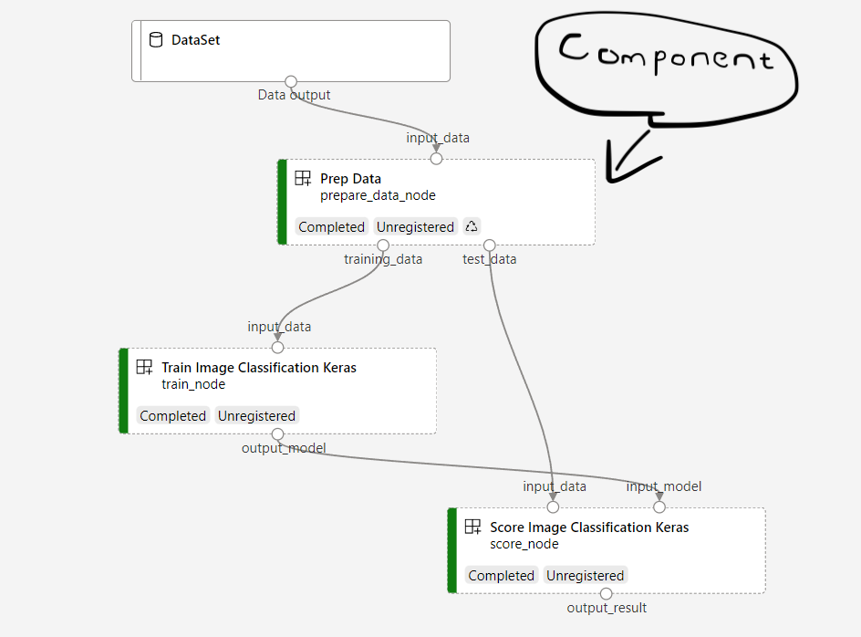

# Components

## Motivations

Components permit reusable scripts that can be shared across AML workspaces. They can additionally construct pipelines. Typically, they are purposeful when preparing code for production. 

In MLOps components can, e.g., detect model drift or prepare training data. The beauty of components arise from the semantization of code into production-ready building elements.

## Constituents

1. **Metadata** (name, version etc.)
2. **Interface I/O** (expected arguments and outputs)
3. **Command**, **code** and **environment**

In order to create a component, the workflow and respective instructions are required. These take the form of a **script** and ```YAML``` file.


# Pipelines



Components can be ordered to create flow logic in machine learning operations, to construct a **pipeline**. They can be built with the ```@pipeline()``` decorator over a function that specifies the inputs and outputs of the pipeline. The result can be viewed by in a ```YAML``` file.


