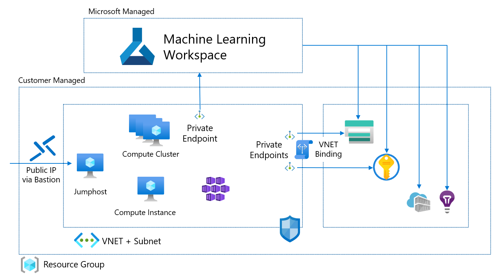

# Azure-ML-material
Notes and basic Azure ML SDK v2 code for, e.g., training and deploying models in Azure Machine Learning (AML)



Mainly for preparation for the Azure Data Scientist certification. 

# Structure

```
📁 Azure-ML-material
├── 📁 Components-and-pipelines
│   ├── 📘 NOTES.md
│   └── 🐍 pipeline.py
├── 📁 Compute-Targets
│   ├── 🐍 compute.py
│   └── 📘 NOTES.md
├── 📁 Endpoints
│   ├── 🐍 endpoint-deployment.py
│   └── 📘 NOTES.md
├── 📁 Using-Data
│   ├── 🐍 aml-data-sources.py
│   └── 📘 NOTES.md
└── 📘 README.md
```
